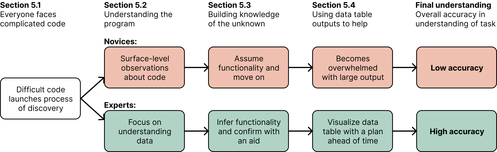

I care about application! I believe that a key aspect of learning is understanding how to apply knowledge to real-life 
scenarios. This page is dedicated to showcasing the projects and research I've done with other talented individuals, 
documenting journey of applying what I've learned. It serves as both a demonstration of my work and a space of 
self-reflection.

# Projects
---

  

    
    <a href="/projects/scripps-research-data-integration/">
      <h3>Scripps Research: Data Integration</h3>
    </a>
    
<strong>Description:</strong> Research on integrating large-scale biological datasets for analysis.

    
<strong>Tag:</strong> Data Science, Bioinformatics

  

  

    
    <a href="/projects/recommendation-system/">
      <h3>Recommendation System Project</h3>
    </a>
    
<strong>Description:</strong> Built a recommendation system using collaborative filtering techniques.

    
<strong>Tag:</strong> Machine Learning, Python

  

  

    
    <a href="/projects/flight-analysis/">
      <h3>Flight Analysis Project</h3>
    </a>
    
<strong>Description:</strong> Analyzed flight datasets to identify profitable round-trip routes.

    
<strong>Tag:</strong> Data Analysis, Pandas

  

  

    
    <a href="/projects/dsc80-project/">
      <h3>DSC 80 Project</h3>
    </a>
    
<strong>Description:</strong> A data science project exploring advanced techniques in data cleaning and analysis.

    
<strong>Tag:</strong> Data Science, Python

  

  

    
    <a href="/projects/covidwalk-research/">
      <h3>COVID Walk Research</h3>
    </a>
    
<strong>Description:</strong> Explored human mobility patterns during the COVID-19 pandemic.

    
<strong>Tag:</strong> Visualization, Data Analysis

  

# Research
---

  

    
    <h3>DSTL Lab: Investigation on Effective Data Analytical Strategies</h3>
    

      <a href="../assets/files/2025_sigcse_experts_vs_novices_SIGCSE.pdf" style="text-decoration: none; font-weight: bold;">Paper</a> | 
      <a href="https://github.com/dstl-lab/Code-Comprehension-User-Study" style="text-decoration: none; font-weight: bold;">Study Material</a>
    

    
In this paper, we conducted a user speak-aloud study to explore effective practices
    that novice data scientists can do to understand data science workbooks. In the paper, we propose three key
    methodologies: <strong>understanding the data schema</strong>, <strong>guess-and-check</strong>, and 
    <strong>goal-oriented exploration</strong>.

    
<strong>Tag:</strong> Data Science, Education, Exploratory Data Analysis

  

  
  

    
    <a href="/projects/scripps-research-data-imputation/">
      <h3>Scripps Research: Data Imputation</h3>
    </a>
    
<strong>Description:</strong> Research focused on imputing missing data in microbiome datasets.

    
<strong>Tag:</strong> Data Science, Biostatistics

  

